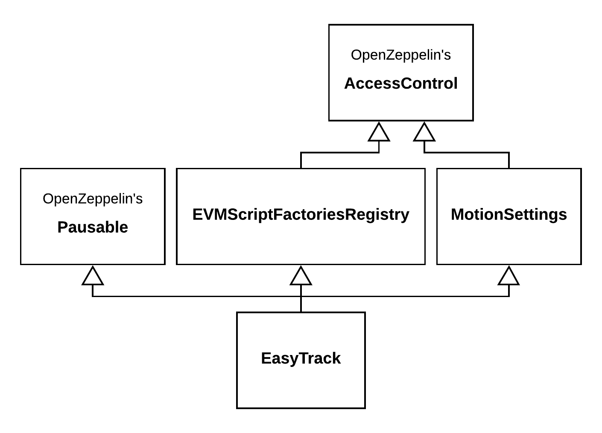

# Abstract

**Easy Track** is a type of voting where a motion is considered to have passed if the minimum objections threshold hasn’t been reached.

**EasyTrack contract** is the main contract, which implements the Easy Track voting mechanism. EasyTrack contract inherits from several OpenZeppelin contracts:

- [AccessControl](https://github.com/OpenZeppelin/openzeppelin-contracts/blob/0c4de6721d9668d7b5b2c5a9400fd0b2a5e8de90/contracts/access/AccessControl.sol) - to restrict access to some methods only to a set of admin addresses. **Admin of Easy Track** - is an address granted with `DEFAULT_ADMIN_ROLE`. By default, Admin of Easy Track will be Aragon's Voting address.
- [Pausable](https://github.com/OpenZeppelin/openzeppelin-contracts/blob/0c4de6721d9668d7b5b2c5a9400fd0b2a5e8de90/contracts/security/Pausable.sol) - to implement the ability to freeze enactment and creation of motions. Pausing allowed for addresses with role `PAUSE_ROLE` and unpausing – for addresses with role `UNPAUSE_ROLE`. By default, both roles are assigned to the Admin of Easy Track.

Easy Track is strongly inspired by Aragon's Voting and based on Aragon's [EVMScripts](https://hack.aragon.org/docs/aragonos-ref#evmscripts-1) concept. Execution of EVMScripts is performed by standalone EVMScriptExecutor contract, which can be called only by EasyTrack contract. Implementation of EVMScriptExecutor used in EasyTrack contract delegates execution of EVMScripts to Aragon's [CallsScript](https://github.com/aragon/aragonOS/blob/v4.0.0/contracts/evmscript/executors/CallsScript.sol#L25) executor.

As opposed to Aragon's Voting, EasyTrack contract doesn't allow to pass EVMScripts directly, and uses standalone **EVMScript factory** contracts to create EVMScripts. **EVMScript factory** - is a special contract, which implements [IEVMScriptFactory](#ievmscriptfactory) interface. Each EVMScript factory has to be registered in the EasyTrack contract before it can be used for motion creation. Registration of EVMScript factory contracts is allowed only to Admins of Easy Track.

To enhance the security of Easy Track, each EVMScript factory has its own **Permissions** set when a new EVMScript factory is being registered in the EasyTrack contract. **Permissions** is a list of tuples `(address, bytes4)` encoded into a bytes representation. Each tuple `(address, bytes4)` describes a method allowed to be called by EVMScript generated by the corresponding EVMScript factory. EasyTrack validates each EVMScript to satisfy permissions and reverts transaction if EVMScript tries to call a method not listed in its permissions.

EasyTrack contract stores motion data in the following struct:

```solidity=
struct Motion {
    uint256 id;
    address evmScriptFactory;
    address creator;
    uint256 duration;
    uint256 startDate;
    uint256 snapshotBlock;
    uint256 objectionsThreshold;
    uint256 objectionsAmount;
    bytes32 evmScriptHash;
}
```

EasyTrack contract doesn't store EVMScripts on-chain but only keccak256 hash of it. On enactment of motion, EasyTrack contract recreates EVMScript using corresponding EVMScript factory and compares the hash of recreated EVMScript with the stored hash; if it matches, EasyTrack contract passes EVMScript to EVMScriptsExecutor and reverts in other cases.

The lifecycle of motion in the easy track voting might be described as follows:

1. A motion can be started by calling `createMotion(address _evmScriptFactory, bytes _evmScriptFactoryCallData)` function on EasyTrack contract.
2. Upon motion creation, EasyTrack contract calls `createEVMScript(msg.sender, _evmScriptFactoryCallData)` function on the corresponding EVMScript factory contract passing all the data required to generate a motion enactment EVMScript.
3. EVMScript factory smart contract generates the script and returns it to the EasyTrack contract.
4. EasyTrack contract conducts the motion according to the motion settings (i.e. motion duration, objections threshold, and max active motions limit).
5. As soon as the motion duration expires, it becomes possible to enact the motion via `enactMotion(uint256 _motionId, bytes evmScriptFactoryCallData)`.
6. To enact the motion, the EasyTrack contract recreates EVMScript via the corresponding EVMScript factory contract and passes it to the `EVMScriptExecutor` smart contract.

Additionally to the creating, enacting, and objecting motions, EasyTrack contract allows the creator of the motion to cancel it at any time while it wasn't enacted. It might be convenient in some cases: passed wrong data to EVMScript factory on motion creation or inability to enact motion due to the changed state of outer contracts etc.

Addresses with the role `CANCEL_ROLE` have the right to cancel any motions. EasyTrack contract has two methods for it: to cancel a list of motions or all motions at once. By default, `CANCEL_ROLE` is granted to Aragon's Voting address.

To prevent motion spamming, EasyTrack contract limits the count of active motions. By default, the limit is 12 active motions. This value can be changed in the future by the Admin of Easy Track. But the new value can't be greater than 24.

Default enact delay for motions equals 48 hours. It might be changed by the Admin of Easy Track, but the new value can't be less than 48 hours.

Default objections threshold equals 0.5%. It might be changed by the Admin of Easy Track, but the new value can't be greater than 5%.

# Core Contracts

As it was mentioned above, EasyTrack is the main contract in the implementation of the Easy Track voting model.
To improve the readability and simplicity of the EasyTrack contract, groups of methods and associated variables are moved to standalone contracts:

- [MotionSettings](#motionsettings) - keeps functionality to set objections threshold, max amount of active motions, and time required to allow motion to be enacted.
- [EVMScriptFactoriesRegistry](#evmscriptfactoriesregistry) - keeps functionality to add/remove EVMScriptFactories and create EVMScripts.

Such separation helps to keep in EasyTrack contract only the data and methods related to Easy Track logic directly. The whole inheritance graph can be seen in the picture below.

<p align="center">
    
</p>

## MotionSettings

Provides functionality to update motion settings of Easy Track: motion duration, objections threshold, and limit of active motions. Inherits from `AccessControl`.

### Storage Variables

Below variables used to control motion duration, max count of active motions, and threshold of objections, required to reject the motion.

- **`uint256 objectionThreshold`** - percent from total supply of governance tokens required to reject motion. Value stored in basis points: 1% == 100. Max allowed value is 5%. Default value is 0.5%.
- **`uint256 motionsCountLimit`** - max count of active motions. Max allowed value is 24. Default value is 12.
- **`uint256 motionDuration`** - minimal time required to pass before enacting of motion. Min allowed value is 48 hours. The default value is 48 hours.

### Constructor

### constructor(address \_admin, uint256 \_motionDuration, uint256 \_motionsCountLimit, uint256 \_objectionsThreshold)

Grants `DEFAULT_ADMIN_ROLE` to `_admin` address, validates values of passed variables `_motionDuration`, `_motionsCountLimit`, `motionDuration`, sets corresponding values if all conditions met and emits `ObjectionsThresholdChanged`, `MotionDurationChanged` and `MotionDurationChanged` events.

### Methods

#### function setMotionDuration(uint256 \_motionDuration) external onlyRole(DEFAULT_ADMIN_ROLE)

Sets the duration of newly created motions. The minimum value is 48 hours. Can be called only by the Admin of Easy Track.

Events:

```solidity=
event MotionDurationChanged(uint256 _motionDuration);
```

#### function setObjectionsThreshold(uint256 \_objectionsThreshold) external onlyRole(DEFAULT_ADMIN_ROLE)

Sets new objectionsThreshold value. Maximum value is 5%
Can be called only by the Admin of Easy Track.

Events:

```solidity=
event ObjectionsThresholdChanged(uint256 _newThreshold)
```

#### function setMotionsCountLimit(uint256 \_motionsCountLimit) external onlyRole(DEFAULT_ADMIN_ROLE)

Sets new value for `motionsCountLimit`. Max value is 24. Can be called only by the Admin of Easy Track.

Events:

```solidity=
event MotionsCountLimitChanged(uint256 _newMotionsCountLimit)
```

## EVMScriptFactoriesRegistry

Provides methods to add/remove EVMScript factories and contains an internal method for the convenient creation of EVMScripts. Inherits from `AccessControl`.

### Storage Variables

Below variables used to control the list of allowed EVMScript factories of Easy Track.

- **`address[] evmScriptFactories`** - current list of allowed EVMScript factories.
- **`mapping(address => bytes) evmScriptFactoriesPermissions`** - permissions of current list of allowed EVMScript factories.

### Constructor

#### constructor(address \_admin)

Grants `DEFAULT_ADMIN_ROLE` to `_admin` address.

### Methods

#### addEVMScriptFactory(address \_evmScriptFactory, bytes \_permissions) external onlyRole(DEFAULT_ADMIN_ROLE)

Adds new EVMScript Factory to the list of allowed EVMScript factories with given permissions. Can be called only by the Admin of Easy Track.

Events:

```solidity=
event EVMScriptFactoryAdded(address indexed _evmScriptFactory, bytes _permissions)
```

#### removeEVMScriptFactory(address \_evmScriptFactory) external onlyRole(DEFAULT_ADMIN_ROLE)

Removes EVMScript factory from the list of allowed EVMScript factories. Can be called only by the Admin of Easy Track.

Events:

```solidity=
event EVMScriptFactoryRemoved(address indexed _evmScriptFactory)
```

#### getEVMScriptFactories() external view returns (address[])

Returns a list of registered EVMScript factories.

#### isEVMScriptFactory(address \_maybeEVMScriptFactory) external view returns (bool)

Returns if `_maybeEVMScriptFactory` address listed as EVMScript factory or not.

#### \_createEVMScript(address \_evmScriptFactory, address \_creator, bytes \_evmScriptCallData) internal returns (bytes \_evmScript)

Creates EVMScript using `_evmScriptFactory` EVMScript factory with `_evmScriptCallData` parameters. Validates that generated EVMScript meets permissions of corresponding EVMScript factory.

## EasyTrack

Contains main logic of Easy Track. Inherits from `Pausable`, `AccessControl`, `MotionSettings` and `EVMScriptFactoriesRegistry`.

### Storage Variables

Below variables used in primary Easy Track actions:

- **`Motion[] motions`** - list of active motions.
- **`IMiniMeToken governanceToken`** - address of governance token. Token has to implement balance history interface of [MiniMeToken](https://github.com/Giveth/minime#balance-history-is-registered-and-available-to-be-queried). Only holders of this token can send objections.Only holders of this token can submit objections.
- **`IEVMScriptExecutor evmScriptExecutor`** - address of EVMScriptExecutor
- **`mapping(uint256 => mapping(address => bool)) objections`** - stores if motion with given id has been objected from given address.

### Constructor

#### constructor(address \_governanceToken, address \_admin, uint256 \_motionDuration, uint256 \_motionsCountLimit, uint256 \_objectionsThreshold)

Calls parent constructors: `EVMScriptFactoriesRegistry(_admin)` and `MotionSettings(_admin, _motionDuration, _motionsCountLimit, _objectionsThreshold)`, sets value for `governanceToken` variable, grants roles `DEFAULT_ADMIN_VALUE`, `PAUSE_ROLE`, `UNPAUSE_ROLE`, `CANCEL_ROLE` to `_admin` address.

### Methods

#### function createMotion(address \_evmScriptFactory, bytes memory \_evmScriptCallData) external whenNotPaused returns (uint256 \_newMotionId)

Creates new motion and returns the id of created motion. Passed `_evmScriptFactory` address must be registered as allowed EVMScript factory.

Evens:

```solidity
event MotionCreated(
    uint256 indexed _motionId,
    address _creator,
    address indexed _evmScriptFactory,
    bytes _evmScriptCallData,
    bytes _evmScript
)
```

#### function enactMotion(uint256 \_motionId, bytes memory \_evmScriptCallData) external whenNotPaused

If a motion with a given id wasn't rejected or canceled and time passed from motion creation is greater than the duration of the motion, removes motion and executes script generated by the EVMScript factory associated with motion. To execute the EVMScript, EasyTrack recreates it with passed `_evmScriptCallData` params via EVMScript factory stored in `motion.evmScriptFactory` property. Transaction will fail if the hash of recreated EVMScript does not match `evmScriptHash` stored in motion.

Events:

```solidity=
event MotionEnacted(uint256 indexed _motionId)
```

#### function cancelMotion(uint256 \_motionId) external

Removes motion from list of active motions. Motion can be canceled only by the creator of motion.

Events:

```solidity=
event MotionCanceled(uint256 indexed _motionId);
```

#### function objectToMotion(uint256 \_motionId) external

Submits an objection from `governanceToken` holder. The objection power equals the number of tokens held. Since `governanceToken` is MiniMeToken, it utilizes `balanceOfAt` and `totalSupplyAt` methods to prevent multiple objections submitted with the same tokens. If `objectionsThreshold` has been reached, the motion will be deleted and `MotionRejected` event will be emitted.

Events:

```solidity=
event ObjectionSent(
    uint256 indexed _motionId,
    address indexed _voterAddress,
    uint256 _weight,
    uint256 _votingPower
)
event MotionRejected(uint256 indexed _motionId)
```

#### function cancleMotions(uint256[] memory \_motionIds) external onlyRole(CANCEL_ROLE)

Cancels each motion with id contained in the `_motionIds` array. Can be called only by address granted with `CANCEL_ROLE`. If some of the passed ids don't exist, skips them. Emits `MotionCanceled` event for each canceled motion.

Events:

```solidity=
event MotionCanceled(uint256 indexed _motionId);
```

#### function cancelAllMotions() external onlyRole(CANCEL_ROLE)

Cancels all active motions. Can be called only by address granted with `CANCEL_ROLE` permission. Emits events `MotionCanceled` for each canceled motion.

Events:

```solidity=
event MotionCanceled(uint256 indexed _motionId);
```

#### function setEVMScriptExecutor(address \_evmScriptExecutor) external onlyRole(DEFAULT_ADMIN_ROLE)

Sets new EVMScriptExecutor. Can be called only by Admin of Easy Track.

Events:

```solidity=
emit EVMScriptExecutorChanged(address indexed _evmScriptExecutor)
```

#### function pause() external whenNotPaused onlyRole(PAUSE_ROLE)

Pauses Easy Track if it isn't paused. Paused Easy Track can't create and enact motions. Can be called only by address granted with `PAUSE_ROLE`.

#### function unpause() external whenPaused onlyRole(UNPAUSE_ROLE)

Unpauses Easy Track if it is paused. Can be called only by address granted with `UNPAUSE_ROLE`.

#### function getMotions() external view returns (Motion[] memory)

Returns list of motions not enacted and not canceled yet.

#### function getMotion(uint256 \_motionId) external view returns (Motion memory)

Returns motion with the given id.

#### function canObjectToMotion(uint256 \_motionId, address \_objector) external view returns (bool)

Returns if an `_objector` can submit an objection to motion with id equals to `_motionId` or not.

## EVMScriptExecutor

Contains method to execute EVMScripts. Inherits from OpenZeppelin's `Ownable` contract. EVMScript uses format of Aragon's [CallsScript](https://github.com/aragon/aragonOS/blob/v4.0.0/contracts/evmscript/executors/CallsScript.sol) executor. The next grammar describes EVMScript:

```
EVM_SCRIPT       -> SPEC_ID | SPEC_ID EVM_SCRIPTS_LIST
EVM_SCRIPTS_LIST -> EVM_SCRIPT_ITEM | EVM_SCRIPTS_LIST
EVM_SCRIPT_ITEM  -> ADDRESS CALL_DATA_LENGTH CALL_DATA
SPEC_ID          -> uint32
ADDRESS          -> address
CALL_DATA_LENGTH -> uint32
CALL_DATA        -> bytes of length CALL_DATA_LENGTH
```

### Methods

#### function executeEVMScript(bytes memory \_evmScript) external returns (bytes memory)

Executes passed EVMScripts and returns empty bytes as a result. This method might be called only by the EasyTrack contract. Current realization uses deployed contract of Aragon's default [CallsScript.sol](https://github.com/aragon/aragonOS/blob/v4.0.0/contracts/evmscript/executors/CallsScript.sol) executor. `EVMScriptExecutor.executeEVMScript` makes delegate call to `CallsScript.execScript` and returns the result of its execution(`CallsScript` always returns empty byte array on success) if the call was successful or reverts with error forwarded from `CallsScript.execScript` in other cases.

Events:

```solidity=
event ScriptExecuted(address indexed _caller, bytes _evmScript)
```

#### function setEasyTrack(address \_easyTrack) external onlyOwner

Sets new address of EasyTrack. Validates that `_easyTrack` is a contract. Can be called only by the owner of the contract.

Events:

```solidity=
event EasyTrackChanged(address indexed _previousEasyTrack, address indexed _newEasyTrack)
```

## IEVMScriptFactory

Interface which every EVMScript factory used in EasyTrack contract has to implement.

### Methods

#### function createEVMScript(address \_creator, bytes \_evmScriptCallData) external returns (bytes)

Creates new EVMScript using passed arguments. The method might apply validations or checks before creation and reverts with an error if some requirements haven't been fulfilled. EasyTrack contract uses `msg.sender` as value for `_creator` argument when called in create method, and `motion.creator` value when called in enact method.

# EVMScript Factories

At this moment Easy Track has following EVMScript factories:

- [IncreaseNodeOperatorStakingLimit](#increasenodeoperatorstakinglimit)
- [TopUpLegoProgram](#topuplegoprogram)
- [TopUpRewardPrograms](#topuprewardprograms)
- [AddRewardProgram](#addrewardprogram)
- [RemoveRewardProgram](#removerewardprogram)

## IncreaseNodeOperatorStakingLimit

Creates EVMScript to increase staking limit for node operator with the given id. Only node operators registered in NodeOperatorsRegistry can create motions with this EVMScript factory.

### Methods

#### function createEVMScript(address \_creator, bytes \_evmScriptCallData) external view returns (bytes)

Creates EVMScript to increase node operators staking limit. `_evmScriptCallData` has to contain encoded tuple: `(uint256 _nodeOperatorId, uint256 _stakingLimit)`, where `_nodeOperatorId` - id of node operator in [NodeOperatorsRegistry](https://github.com/lidofinance/lido-dao/blob/553a4afb9c7c13d1aac03713f24e95d1d07591d7/contracts/0.4.24/nos/NodeOperatorsRegistry.sol), `_stakingLimit` - new staking limit
To successfully create EVMScript next requirements must be met:

- Reward address of the node operator must be equal to the address of the `_creator`
- Node Operator must be not disabled.
- New staking limit must be greater than the current staking limit
- Total amount of signing keys must be greater than or equal to the new staking limit

#### function decodeEVMScriptCallData(bytes \_evmScriptCallData) external returns (uint256 \_nodeOperatorId, uint256 \_stakingLimit)

Decodes `_evmScriptCallData` into tuple `(uint256 _nodeOperatorId, uint256 _stakingLimit)`.

## TopUpLegoProgram

Creates EVMScript to top up the address of the LEGO program. Allows making transfers of ERC20 tokens and ETH. Only `trustedCaller` address can create motions with this EVMScript factory.

### Methods

#### function createEVMScript(address \_creator, bytes \_evmScriptCallData) external view returns (bytes)

Creates EVMScript to make new immediate payments to LEGO program address. `_evmScriptCallData` contains encoded tuple: `(address[] _rewardTokens, uint256[] _amounts)`, where `_rewardTokens` - addresses of ERC20 tokens (zero address for ETH) to transfer, `_amounts` - corresponding amount of tokens to transfer. To successfully create EVMScript next requirements must be met:

- `_creator` must be equal to `trustedCaller` address
- `_rewardTokens` and `_amounts` have same length
- `_rewardTokens` and `_amounts` are not empty
- `_amounts` has no zero values

#### function decodeEVMScriptCallData(bytes \_evmScriptCallData) external returns (address[] rewardTokens, uint256[] amounts)

Decodes `_evmScriptCallData` into tuple `(address[] rewardTokens, uint256[] amounts)`.

## TopUpRewardPrograms

Creates EVMScript to top up balances of reward programs. Transfers allowed only to the restricted list of addresses. To control the whitelist of allowed addresses of reward programs, `TopUpRewardPrograms` uses the contract `RewardProgramsRegistry`, which stores addresses of reward programs. Only `trustedCaller` address can create motions with this EVMScript factory.

### Methods

#### function createEVMScript(address \_creator, bytes \_evmScriptCallData) external view returns (bytes)

Creates EVMScript to make new immediate payments to list of reward programs. `_evmScriptCallData` contains encoded tuple: `(address[] _rewardPrograms, uint256[] _amounts[])`, where `_rewardPrograms` - addresses of reward programs to top up, `_amounts` - corresponding amount to transfer. To successfully create EVMScript next requirements must be met:

- `_creator` must be equal to `trustedCaller` address
- `_rewardPrograms` and `_amounts` have same length
- `_rewardPrograms` and `_amounts` are not empty
- `_amounts` has no zero values
- each address in `_rewardPrograms` listed in `RewardProgramsRegistry` as valid reward program

#### function decodeEVMScriptCallData(bytes \_evmScriptCallData) external returns (address[] rewardPrograms, uint256[] amounts)

Decodes `_evmScriptCallData` into tuple `(address[] rewardPrograms, uint256[] amounts)`.

## AddRewardProgram

Creates EVMScript to add new reward program address to `RewardProgramsRegistry`. Only `trustedCaller` address can create motions with this EVMScript factory.

### Methods

#### function createEVMScript(address \_creator, bytes \_evmScriptCallData) external view returns (bytes)

Creates EVMScript to add new reward address to `RewardProgramsRegistry`. `_evmScriptCallData` contains encoded tuple: `(address _rewardProgram, string _title)`, where `_rewardProgram` - new reward program address to add, `_title` - title of new reward program. To successfully create EVMScript next requirements must be met:

- `_creator` must be equal to `trustedCaller` address
- `_rewardProgram` address hasn't been added in `RewardProgramsRegistry` earlier.

#### function decodeEVMScriptCallData(bytes \_evmScriptCallData) external returns (address \_rewardProgram, string memory \_title)

Decodes `_evmScriptCallData` into tuple `(address _rewardProgram, string _title)`.

## RemoveRewardProgram

Creates EVMScript to remove reward program from `RewardPrgoramsRegistry`. Only `trustedCaller` address can create motions with this EVMScript factory.

### Methods

#### function createEVMScript(address \_creator, bytes \_evmScriptCallData) external view returns (bytes)

Creates EVMScript to remove reward program from `RewardProgramsRegistry`. `_evmScriptCallData` contains encoded tuple: `(address _rewardProgram)`, where `_rewardProgram` - reward address to remove. To successfully create EVMScript next requirements must be met:

- `_creator` must be equal to `trustedCaller` address
- `_rewardProgram` address must be listed in `RewardProgramsRegistry`.

#### function decodeEVMScriptCallData(bytes \_evmScriptCallData) external returns (address \_rewardProgram)

Decodes `_evmScriptCallData` into tuple `(address _rewardProgram)`.

## RewardProgramsRegistry

Stores list of addresses with reward programs. Inherits from OpenZeppelin's `AccessControl` contract. TopUpRewardsProgram EVMScript factory allows transfers only to addresses listed in RewardProgramsRegistry.

### Methods

#### addRewardProgram(address \_rewardProgram, string memory \_title) external

Adds reward program address to RewardProgramsRegistry, if it hasn't been added yet, throws `"REWARD_PROGRAM_ALREADY_ADDED"` in other cases. Can be called only by address granted with `ADD_REWARD_PROGRAM_ROLE`.

Events:

```solidity=
event RewardProgramAdded(address indexed _rewardProgram, string _title)
```

#### removeRewardProgram(address \_rewardProgram) external

Removes reward program address from RewardProgramsRegistry. Throws `"REWARD_PROGRAM_NOT_FOUND"` if program address misses from the array. Might be called only by EVMScriptExecutor contract. Can be called only by address granted with `REMOVE_REWARD_PROGRAM_ROLE`.

Events:

```solidity=
event RewardProgramRemoved(address indexed _rewardProgram)
```

#### isRewardProgram(address \_rewardProgram) external view (returns bool)

Shows if address is whitelisted in RewardProgramsRegistry.

#### getRewardPrograms() external view returns (address[])

Returns list of whitelisted reward programs

## TrustedCaller

Helper contract contains logic to validate that only a trusted caller has access to certain methods. Might be inherited by other contracts to reduce the amount of redundant code.

### Storage Variables

```solidity=
address trustedCaller;
```

### Modifiers

#### modifier onlyTrustedCaller(address \_caller)

Compares the passed `_caller` value to the current `trustedCaller` value and throws `"CALLER_IS_FORBIDDEN"` in case addresses do not match.
